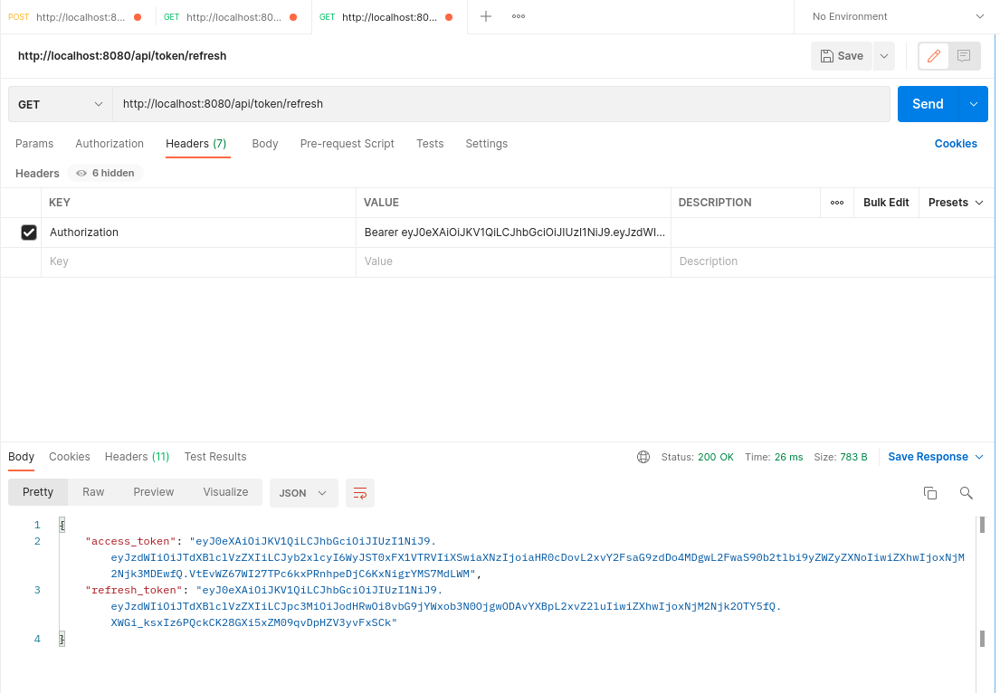

#SpringBootDocker


front: http://localhost:8081/

to build back:
```bash
mvn -U clean install -DskipTests
```
to build front:
```bash
cd frontend
npm install
export NODE_OPTIONS=--openssl-legacy-provider
npm run build -openssl-legacy-provider
```
to run:
```bash
sudo docker-compose up
sudo docker-compose up -d --build
```
to stop:
```bash
sudo docker-compose down
```
app: http://localhost:8080/

api: http://localhost:8080/api/v1/heroes/1

users api: http://localhost:8080/api/users

user: User  
password: 12345678  
user: Admin  
password: 87654321

Authorize with username and password  
Postman:
POST http://localhost:8080/api/login
Body:
x-www-form-urlencoded
username SuperUser
password 12345678


Login with token  
Postman:
GET http://localhost:8080/api/users
Headers:
Key Authorization
Value Bearer + (value from access_token)


Refresh token:  
GET http://localhost:8080/api/token/refresh
Headers:
Key Authorization
Value Bearer + (value from refresh_token)

here you get a new pair of access_token and refresh_token
so you can take new access_token and login with it

to clean:
```bash
sudo docker ps -a

sudo docker rm <CONTAINER ID of springbootdocker_app>

sudo docker rm  <CONTAINER ID of postgres>

sudo docker images

sudo docker image rm <IMAGE ID of  springbootdocker_app>
```
